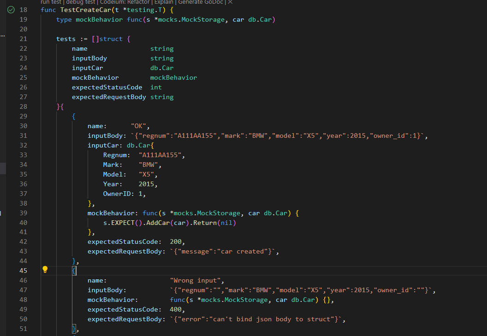
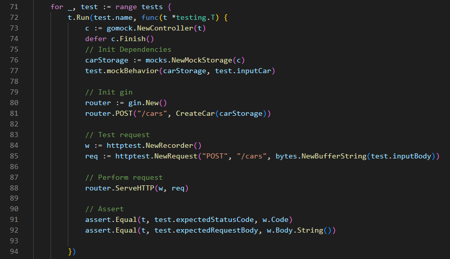
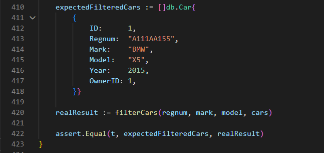
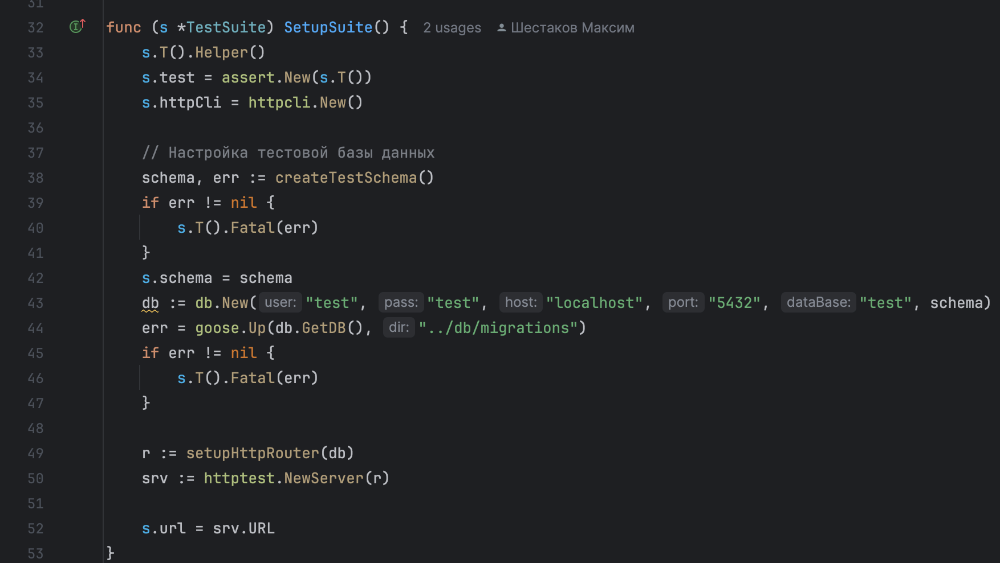
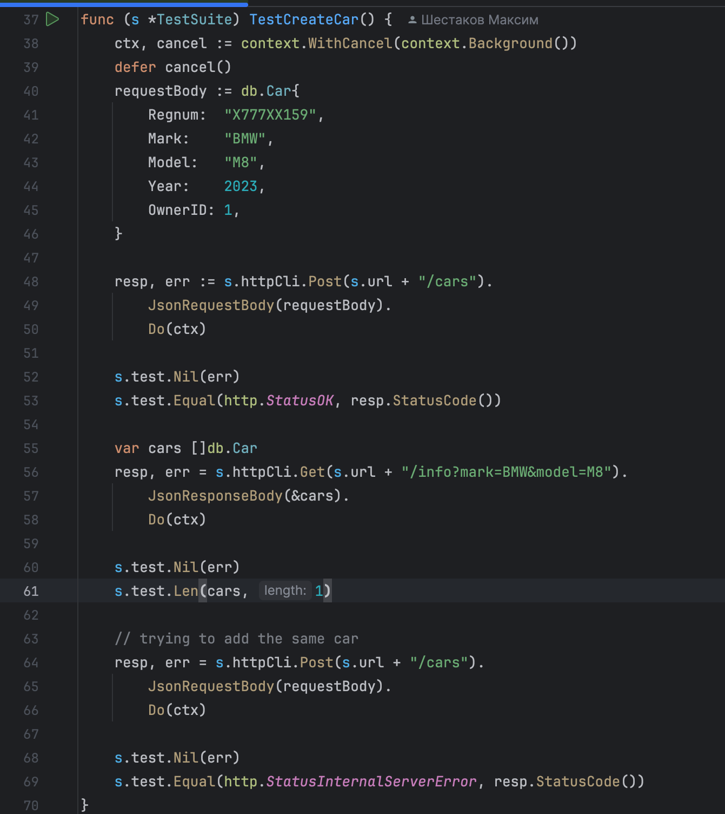

# Effective-Mobile
Тестовое задание для компании Effective Mobile

## Общая информация по проекту:

Для реализации каталога был написан файл миграций, при запуске сборки отслеживается последняя временная метка миграций. Для СУБД использован PostgreSQL, в качестве фреймворка для HTTP-сервера - gin. Создана документация в формате Swagger 2.0, задокументированы как хэндлеры, так и модели проекта. Написаны UNIT-тесты, покрытие кода на 100%.

## Технологии и используемые пакеты:

- Миграции через goose
- Docker (Dockerfile, docker-compose)
- Swagger 2.0 (Open API 3.0)
- Gin-router
- СУБД PostgreSQL
- Unit-тесты
- Mock-objects (для Unit-тестов)

## Описание юнит-тестирования

- Тесты находятся в папке pkg/handlers в файле handlers_test.go
- Покрыт весь функционал CRUD сервиса, а именно:
    - Создание новой записи об автомобиле
    - Удаление записи об автомобиле
    - Обновление записи об автомобиле
    - Получение данных об автомобилях
    - Добавление записи о владельце автомобиля
    - Фильтрация по заданным параметрам

- При определении необходимости тестирования функционала было выбрано сделать акцент на тесте бизнес-логики, замокав возможные ошибки БД, так как они чаще всего происходят по внешним причинам (неустойчивость соединения, параллельный доступ и т.д.).

- Примеры тестов:
    -  Для написания тестов был выбран подход с табличной реализацией ожидаемых результатов, после описания желаемого поведения тесты запускались по циклу и проверяли результат. 
    - На следующем скриншоте можно увидеть инициализацию необходимых модулей системы для проверки функционала: 
    - На данном скриншоте показана часть кода для тестирования внутренней функции фильтрации:  

- Результаты тестирования: 
    - Код покрыт тестами на 100%.


## Описание интеграционного тестирования

- Для тестирования был выбран подход через использование TestSuite - единой конфигурации, при инициализации которой система имела бы все компоненты для теста.
- Тесты находятся в директории tests. 
  - init_test.go - файл сетапа TestSuite, так же в нём есть методы для инициализации схемы базы данных. 
  - handler_integration_test.go - файл с тестами бизнес-логики в интеграции с БД
- Для успешного проведения тестирования необходимо поднять сборку docker-compose, пример файла переменных окружения приложен
- Для каждого теста генерируется отдельная схема, чтобы основная не нагружалась лишними данными
- Пример теста по созданию записи об автомобиле: 
- Результаты интеграционного тестирования:
  - Успешно проверена интеграция базы данных с http-сервером, компоненты работают вместе исправно
  - Выявлена ошибка миграций БД, отсутствие UNIQUE ограничения, которое открывало возможность добавлять дубликаты записей
  - Улучшена возможность поддержки кода благодаря подготовленным тестам на основную логику.


### Команды для сборки и запуска:

- ```docker compose up --build```
- ```docker compose up```

### Команда для остановки и удаления контейнеров:

- ```docker compose down```


